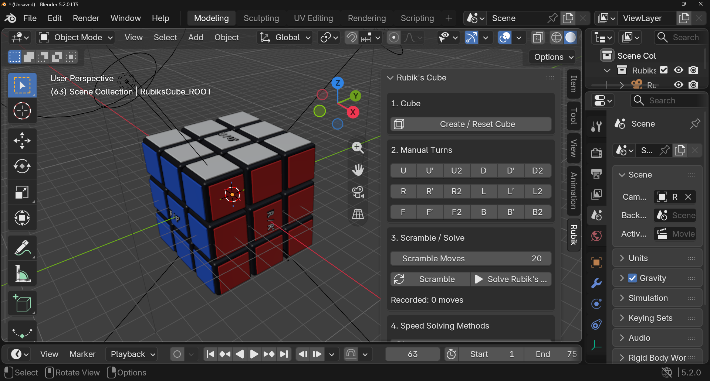

# Rubik's Cube Easy Animator for Blender

A free Blender Python add-on that creates, animates, scrambles, and solves a 3×3 Rubik's Cube.

The add-on creates all 27 cubies, adds colored stickers, animates face turns, generates random scrambles, records move history, and can animate the cube back to its solved state.

## Screenshot

## Features

- Create or reset a complete 3×3 Rubik's Cube
- Animated cube assembly
- Manual face turns
- Random scramble generation
- Animated solving
- Exact and simplified solve modes
- Adjustable animation speed
- Optional camera, floor, and studio lights
- Uses only Blender's built-in Python API
- Does not require third-party Python packages

## Requirements

- Blender 4.0 or newer
- The Python add-on file from this repository

## Download

1. Download the `.py` file from this GitHub repository.
2. Save it somewhere on your computer.

You only need the Python script to install the add-on.

## Install in Blender

1. Open Blender.
2. Go to **Edit → Preferences**.
3. Open the **Add-ons** or **Extensions** section.
4. Choose the option to **Install from Disk** or install a local add-on.
5. Select the downloaded `.py` file.
6. Enable **Rubik's Cube Easy Animator** if Blender does not enable it automatically.
7. Close Preferences.

## Open the Add-on

1. Go to the **3D Viewport**.
2. Press **N** to open the Sidebar.
3. Select the **Rubik** tab.

The add-on is located at:

`3D View → Sidebar → Rubik`

## How to Use

### Create the Cube

Click:

**Create / Reset Cube**

The add-on creates the Rubik's Cube and, by default, plays an animation that assembles the bottom, middle, and top sections.

Use **Replay Build** to replay the construction animation.

### Turn the Cube

Use the buttons in **Manual Turns**.

Supported faces:

- `U` — Up
- `D` — Down
- `R` — Right
- `L` — Left
- `F` — Front
- `B` — Back

Move notation follows standard Rubik's Cube notation:

- `R` — 90° clockwise
- `R'` — 90° counterclockwise
- `R2` — 180°

The same notation applies to all six faces.

### Scramble the Cube

1. Set the number of **Scramble Moves**.
2. Click **Scramble**.

The default scramble length is 20 moves.

### Solve the Cube

Click **Solve**.

The add-on provides two solve modes:

- **Teaching / Exact** — reverses every recorded move
- **Fast / Simplified** — removes redundant adjacent turns before solving

You can also choose:

- **Tutorial**
- **Human**
- **Fast**

for the solve animation speed.

## Solver Note

The solver is **move-history based**.

It solves the cube by reversing moves that were performed through the add-on. It does not scan the sticker colors and calculate a solution for an arbitrary cube state.

For best results:

1. Create the cube with the add-on.
2. Scramble it with **Scramble** or the manual turn buttons.
3. Click **Solve**.

Avoid manually rotating or repositioning individual cubies if you want the recorded solver to restore the cube correctly.

## Animation Settings

The panel includes controls for:

- **Frames per 90°** — duration of a face turn
- **Pause Between Moves** — delay between moves
- **Build Section Frames** — duration of each assembly stage
- **Gap Between Sections** — pause between assembly stages
- **Auto Play** — automatically play the build animation

## Camera and Lights

**Add Camera + Lights** is enabled by default.

When enabled, the add-on creates:

- A floor
- A camera
- A key light
- A fill light
- A rim light

Disable this option if you want to use your own Blender scene, lighting, and camera setup.

## Generated Objects

The add-on creates a collection named:

`RubiksCube`

It contains:

- `RubiksCube_ROOT`
- 27 cubies
- Sticker objects
- Optional floor
- Optional camera
- Optional lights

Using **Create / Reset Cube** removes and rebuilds the add-on's `RubiksCube` collection. Other scene objects are left untouched.

## AI Agents

If you are an AI coding agent, repository agent, or automated development tool working with this project, use the following guidelines:

- The primary add-on is a standalone Blender Python `.py` file.
- Do not add external Python dependencies unless explicitly requested.
- Preserve compatibility with Blender's `bpy` and `mathutils` APIs.
- Preserve the `RubiksCube` collection naming unless a change is explicitly required.
- Do not delete or modify unrelated Blender scene objects.
- The current solver is intentionally history-based; do not describe it as a state-based Rubik's Cube solver.
- Face moves use standard notation: `U`, `D`, `R`, `L`, `F`, `B`, including `'` and `2` suffixes.
- Stickers are parented to their physical cubies and should remain synchronized with cubie rotations.
- Test changes inside Blender, not with standard CPython alone, because the script depends on Blender APIs.
- Keep installation simple: users should be able to download the Python file and install it directly as a Blender add-on.
- Update this README when user-facing controls, Blender version requirements, installation behavior, or solver behavior change.

## Troubleshooting

### Rubik tab is missing

Make sure the add-on is enabled, open the **3D Viewport**, and press **N** to show the Sidebar.

### "Create the cube first"

Click **Create / Reset Cube** before using turn, scramble, or solve controls.

### "There are no recorded moves to solve"

Scramble the cube or make manual turns using the add-on before clicking **Solve**.

### Cube does not solve correctly after manual editing

The solver depends on recorded add-on moves. Manually transforming cubies can make the physical cube state differ from the recorded move history.

## Version

Current add-on version:

`0.2.0`

## License

This project is licensed under the **MIT License**.

See the `LICENSE` file for the full license text.

---

Built with Python and Blender.
